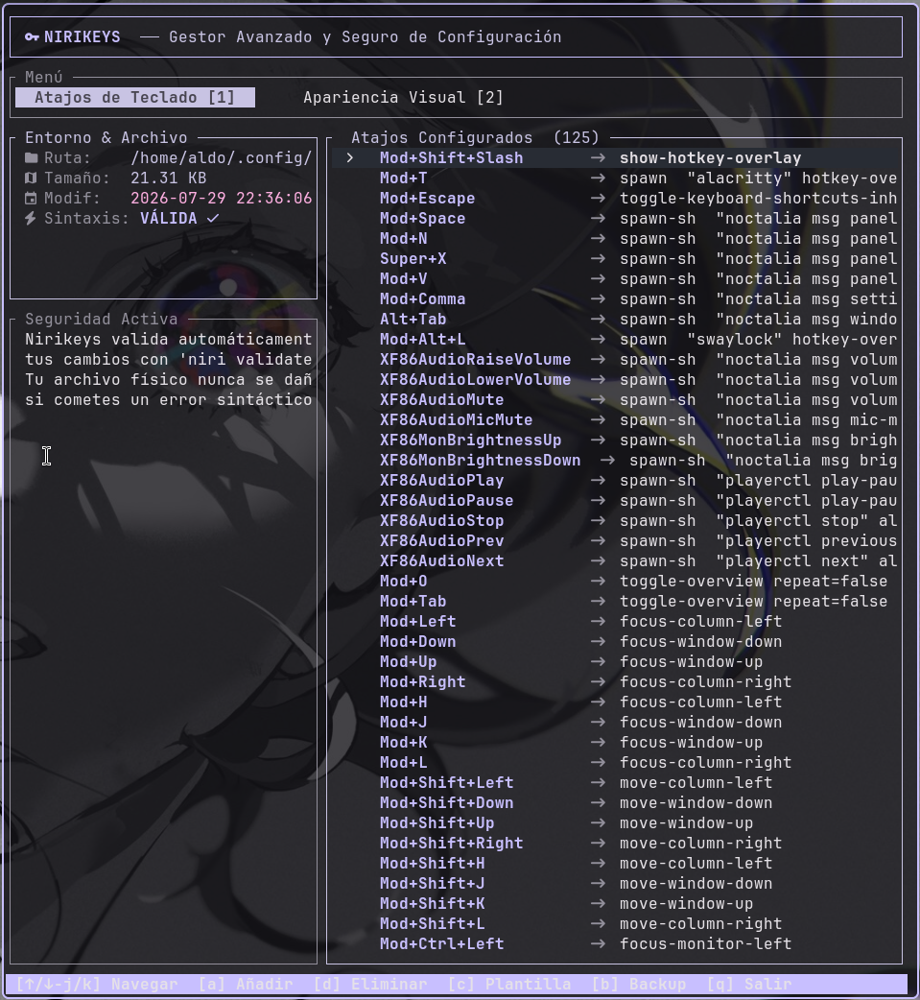

<h1 align="center">NiriKeys</h1>

<p align="center">The advanced, safe, and interactive keyboard shortcut & aesthetics manager for the Niri window manager.</p>
<p align="center">
  <a href="https://github.com/MarkOne-dev/NiriKeys/releases"></a>
  <a href="https://github.com/MarkOne-dev/NiriKeys/actions"></a>
  <a href="https://opensource.org/licenses/MIT"></a>
</p>

> [!IMPORTANT]
> This application is specifically designed and optimized to work **only** with the **Noctalia Shell** environment.

<p align="center">
  
</p>

---

### Installation

```bash
# Easy installer script (YOLO)
curl -sSL https://raw.githubusercontent.com/MarkOne-dev/NiriKeys/main/install.sh | bash

# Install from GitHub via cargo
cargo install --git https://github.com/MarkOne-dev/NiriKeys.git

# Download the latest compiled binary
curl -L https://github.com/MarkOne-dev/NiriKeys/releases/latest/download/nirikeys -o ~/.local/bin/nirikeys && chmod +x ~/.local/bin/nirikeys
```

> [!TIP]
> Ensure that `~/.local/bin` (or your chosen binary path) is in your shell's `$PATH` variable.

### Features

- **Keyboard Shortcuts Tab**: Add, edit, and delete your bindings visually and intuitively.
- **Aesthetic Configuration Tab**: Modify window gaps, border status (on/off), width, colors, focus-ring details, and corner radius directly.
- **Active Syntax Validation**: Changes are verified in memory with `niri validate` before saving physically, preventing a broken environment.
- **Template Merging**: Instantly compare your active configuration with the official standard template to find and import missing keybindings.
- **Automatic Backups**: Keep copies of your working configuration file with a single keypress.
- **Auto Language Detection**: Seamless TUI language switching between English and Spanish.

### TUI Navigation Controls

| Keypress | Action |
| --- | --- |
| `1` | Switch to **Keybindings** tab |
| `2` | Switch to **Aesthetic Configuration** tab |
| `↑/↓` or `j/k` | Navigate lists or properties |
| `a` | Add a new keybinding (Keybindings tab only) |
| `d` | Delete selected keybinding (Keybindings tab only) |
| `e` or `Enter` | Edit selected option (Aesthetic tab only) |
| `c` / `C` | Compare and merge shortcuts from the official template |
| `b` | Create a manual backup of your config file |
| `q` or `Esc` | Quit the application or close popups |

### Documentation

For more instructions and settings, please check the [**Official Niri Documentation**](https://github.com/YaLTeR/niri).

### Contributing

Pull requests and issues are welcome! Feel free to fork the repository and submit your contributions.

---

**Follow the project** [GitHub](https://github.com/MarkOne-dev/NiriKeys)
